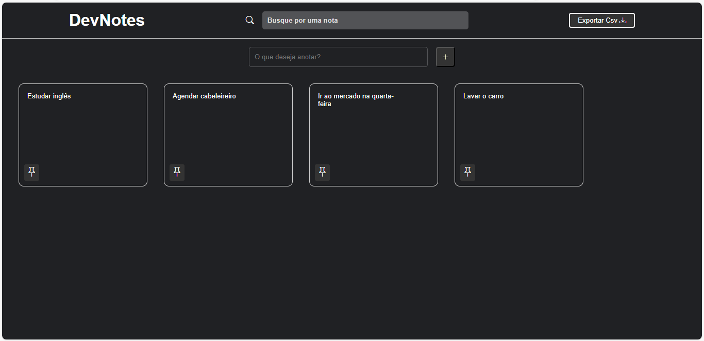

# Projeto: DevNotes

O DevNotes é um aplicativo que podemos adicionar nossas notas que serão salvas na local-storage.  
Podemos inserir uma nova nota digitando-a no campo de input "Adicionar nota" e apertar o Enter ou o botão de adicionar nota que ela será inserida na área de notas.  
Temos nas notas as ações de "fixar" que dá mais destaque e importância a essa nota colocando-a na frente das outras, para desafixar a nota é só clicar novamente no ícone de "fixar".  
Temos nas notas a ação de "Excluir" que é a funcionalidade de deletar as notas.  
Temos nas notas a ação de "Copiar" que é a funcionalidade de duplicar as notas.  
No campo de busca "Busque por uma nota" podemos localizar uma nota inserindo um texto, e o aplicativo exibe as notas que contém esse mesmo texto.  
O aplicativo conta com a funcionalidade de exportar os dados para "csv" gerando um arquivo que pode ser tratado em um software ou uma planilha de Excel. 

### TECNOLOGIAS: 
HTML 
CSS 
JAVASCRIPT 
GIT/GITHUB